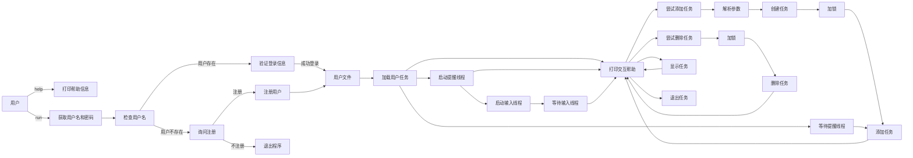

# 任务管理系统设计文档

## 模块与类设计

### 模块

1. `bin`: 存放可执行文件。
2. `build`: 存放构建过程中生成的文件和中间文件。
3. `data`: 存放用户任务数据和用户信息文件。
4. `include`: 存放头文件。
5. `src`: 存放源代码文件。

### 类设计

#### `Task`

负责表示单个任务的信息。

- **成员变量**:
  - `id`: 任务ID
  - `name`: 任务名称
  - `startTime`: 任务开始时间
  - `reminderTime`: 任务提醒时间
  - `priority`: 任务优先级
  - `category`: 任务类别

- **成员函数**:
  - 构造函数
  - `display()`: 显示任务信息

#### `TaskManager`

负责管理用户的任务。

- **成员变量**:
  - `username`: 用户名
  - `tasks`: 存储任务的列表

- **成员函数**:
  - 构造函数
  - `addTask(const Task&)`: 添加任务
  - `deleteTask(int)`: 删除任务
  - `showTasks()`: 显示所有任务
  - `showTasks(std::string)`: 显示指定日期或月份的任务
  - `saveTasks()`: 保存任务到文件
  - `loadTasks()`: 从文件加载任务
  - `checkReminders()`: 检查任务提醒

#### `UserManager`

负责管理用户信息。

- **成员变量**:
  - `users`: 存储用户信息的列表

- **成员函数**:
  - 构造函数
  - `userExists(const std::string&)`: 检查用户是否存在
  - `login(const std::string&, const std::string&)`: 用户登录
  - `registerUser(const std::string&, const std::string&)`: 注册用户

## 接口设计

### 命令行接口

- `myschedule [command]`: 程序入口命令
  - `run`: 启动交互模式
  - `help`: 显示帮助信息

### 交互模式接口

- `addtask [name] [start time] [reminder time] [priority] [category]`: 添加任务
- `deltask [task id]`: 删除任务
- `showtasks [date]`: 显示任务
- `quit`: 退出交互模式

## 流程图

## 关键技术问题说明

1. **多线程处理**:
    - 使用`pthread`库进行多线程处理，一个线程用于处理用户输入，另一个线程用于任务提醒。
    - 线程间通过`pthread_mutex_t`进行互斥锁同步，确保线程安全。

2. **时间解析与格式化**:
    - 使用`std::istringstream`和`std::get_time`进行日期时间字符串解析。
    - 使用`std::tm`结构和`mktime`函数进行时间转换与比较。

3. **任务管理**:
    - 任务添加时进行时间冲突检查，确保不会添加相同开始时间的任务。
    - 任务删除使用`std::remove_if`和`std::vector::erase`进行删除操作。
    - 任务显示时按开始时间排序，使用`std::sort`和自定义比较函数。

4. **文件操作**:
    - 任务保存和加载使用`std::ofstream`和`std::ifstream`进行文件操作。
    - 用户信息和任务数据分别存储在`data`目录下的对应文件中。

5. **错误处理**:
    - 各类操作均有详细的错误处理和提示信息，确保用户友好性。

通过上述设计，任务管理系统能够有效管理用户的任务，提供多线程提醒功能，并通过简洁的命令行接口与用户交互。
