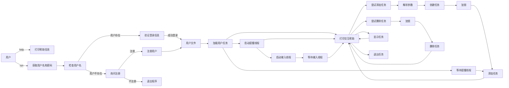

# 任务管理系统设计文档

## 小组成员
黄兰婷: 结构体与类的设计(Task TaskManager UserManager)，main函数编写，多线程编写,流程图绘制

刘佳琪: 所有GUI改编

## 模块与类设计

### 模块

1. `bin`: 存放可执行文件。
2. `build`: 存放构建过程中生成的文件和中间文件。
3. `data`: 存放用户任务数据和用户信息文件。
4. `include`: 存放头文件。
5. `src`: 存放源代码文件。

### 类设计

#### `Task`

负责表示单个任务的信息。

- **成员变量**:
  - `id`: 任务ID
  - `name`: 任务名称
  - `startTime`: 任务开始时间，以time_t形式存储
  - `reminderTime`: 任务提醒时间，以time_t形式存储
  - `priority`: 任务优先级
  - `category`: 任务类别

- **成员函数**:
  - 构造函数
  - `display()`: 显示任务信息

#### `TaskManager`

负责管理用户的任务。

- **成员变量**:
  - `username`: 用户名
  - `tasks`: 存储任务的列表

- **成员函数**:
  - 构造函数
  - `addTask(const Task&)`: 添加任务
  - `deleteTask(int)`: 删除任务
  - `showTasks()`: 显示所有任务
  - `showTasks(std::string)`: 显示指定日期或月份的任务
  - `saveTasks()`: 保存任务到文件
  - `loadTasks()`: 从文件加载任务
  - `checkReminders()`: 检查任务提醒

#### `UserManager`

负责管理用户信息。

- **成员变量**:
  - `users`: 存储用户信息的列表

- **成员函数**:
  - 构造函数
  - `userExists(const std::string&)`: 检查用户是否存在
  - `login(const std::string&, const std::string&)`: 用户登录
  - `registerUser(const std::string&, const std::string&)`: 注册用户

## 具体函数代码
### 函数：`loadUsers()`

- **函数功能：** 加载已注册用户的数据并存储在内存中的`users` map中。从存储用户数据的文件`../data/users.txt`中读取用户名和密码，并将它们存储为键值对。
- **函数输入：** 无
- **函数输出：** 无

#### 函数实现

```cpp
void UserManager::loadUsers() {
    std::ifstream file("../data/users.txt");
    std::string line;
    while (std::getline(file, line)) {
        std::stringstream ss(line);
        std::string username, password;
        std::getline(ss, username, ',');
        std::getline(ss, password, '\n');
        users[username] = password;
    }
}
```

#### 说明

`loadUsers()` 函数通过打开存储用户信息的文件，逐行读取数据，并将每行的用户名和密码分别存储在 `users` map 中的键值对中。文件中每行的格式为 `username,password`，其中 `username` 是用户的用户名，`password` 是经过哈希处理的密码字符串。

---

### 函数：`saveUsers()`

- **函数功能：** 将当前内存中的用户数据保存到文件中。将`users` map 中的每个用户名和密码组成一行文本，并写入到文件`../data/users.txt`中。
- **函数输入：** 无
- **函数输出：** 无

#### 函数实现

```cpp
void UserManager::saveUsers() {
    std::ofstream file("../data/users.txt");
    for (const auto& it : users) {
        file << it.first << "," << it.second << std::endl;
    }
}
```

#### 说明

`saveUsers()` 函数遍历存储用户信息的 `users` map，将每个用户名和对应的密码按照 `username,password` 的格式写入到文件中。每个用户信息占据文件中的一行，以便后续能够重新加载和验证用户数据。

---

### 函数：`userExists(const std::string& username)`

- **函数功能：** 检查给定用户名是否已存在于内存中的 `users` map 中。
- **函数输入：** `username` - 待检查的用户名
- **函数输出：** `true` - 用户名已存在；`false` - 用户名不存在

#### 函数实现

```cpp
bool UserManager::userExists(const std::string& username) {
    return users.find(username) != users.end();
}
```

#### 说明

`userExists()` 函数通过查找 `users` map 中是否存在给定的 `username` 来判断用户是否已经注册。如果 `username` 存在于 `users` map 中，则返回 `true`，否则返回 `false`。

---

### 函数：`registerUser(const std::string& username, const std::string& password)`

- **函数功能：** 注册新用户，将用户名和经过哈希处理的密码存储在内存中的 `users` map 中，并将用户数据保存到文件中。
- **函数输入：** `username` - 新用户的用户名；`password` - 新用户的密码
- **函数输出：** `true` - 注册成功；`false` - 用户名已存在，注册失败

#### 函数实现

```cpp
bool UserManager::registerUser(const std::string& username, const std::string& password) {
    if (users.find(username) != users.end()) {
        return false; // 用户已存在，注册失败
    }
    std::string hashedPassword = hashPassword(password);
    users[username] = hashedPassword;
    saveUsers();
    return true; // 注册成功
}
```

#### 说明

`registerUser()` 函数首先检查是否已经存在相同的 `username`，如果存在则注册失败并返回 `false`；如果不存在，则对密码进行哈希处理后，将用户名和哈希后的密码存储到 `users` map 中，并调用 `saveUsers()` 将新的用户数据持久化到文件中。注册成功后返回 `true`。

---

### 函数：`login(const std::string& username, const std::string& password)`

- **函数功能：** 用户登录验证，检查给定的用户名和密码是否匹配。
- **函数输入：** `username` - 用户名；`password` - 密码
- **函数输出：** `true` - 登录成功；`false` - 登录失败

#### 函数实现

```cpp
bool UserManager::login(const std::string& username, const std::string& password) {
    std::string hashedPassword = hashPassword(password);
    if (users[username] == hashedPassword) {
        return true; // 登录成功
    }
    return false; // 登录失败
}
```

#### 说明

`login()` 函数首先将用户输入的密码进行哈希处理，然后将处理后的哈希密码与内存中存储的对应用户名的哈希密码进行比较。如果匹配，则登录成功并返回 `true`，否则返回 `false` 表示登录失败。

---

### 函数：`hashPassword(const std::string& password)`

- **函数功能：** 使用 MD5 算法对输入的密码进行哈希处理，返回哈希后的字符串。
- **函数输入：** `password` - 待哈希处理的密码
- **函数输出：** 哈希处理后的密码字符串

#### 函数实现

```cpp
std::string UserManager::hashPassword(const std::string& password) {
    return MD5(password).toStr(); // 使用 MD5 算法进行密码哈希处理
}
```

#### 说明

`hashPassword()` 函数通过调用 `MD5` 类对输入的密码进行 MD5 哈希处理，并返回处理后的哈希字符串。这样可以确保用户密码在存储和传输过程中更安全。

---
### 函数：`addTask(const Task& task)`

- **函数功能：** 向用户的任务列表中添加新任务，并将任务数据保存到文件中。
- **函数输入：** `task` - 要添加的任务对象
- **函数输出：** `true` - 添加成功；`false` - 添加失败（任务已存在或其他错误）

#### 函数实现

```cpp
bool TaskManager::addTask(const Task& task) {
    for (const auto& t : tasks) {
        if (t.startTime == task.startTime) {
            std::cerr << "A task with the same start time already exists." << std::endl;
            return false;
        }
        if (t.name == task.name && t.startTime == task.startTime) {
            std::cerr << "Task with the same name and start time already exists!" << std::endl;
            return false;
        }
    }
    tasks.push_back(task);
    saveTasks();
    return true;
}
```

#### 说明

`addTask()` 函数首先检查要添加的任务是否与现有任务具有相同的开始时间或相同的名称和开始时间。如果存在重复，函数将打印错误消息并返回 `false`。如果不存在重复，将任务添加到 `tasks` 容器中，并调用 `saveTasks()` 函数将更新后的任务列表保存到文件中。添加成功后返回 `true`。

---

### 函数：`deleteTask(int taskId)`

- **函数功能：** 根据任务 ID 删除用户的特定任务，并将更新后的任务列表保存到文件中。
- **函数输入：** `taskId` - 要删除的任务的 ID
- **函数输出：** `true` - 删除成功；`false` - 删除失败（未找到指定 ID 的任务）

#### 函数实现

```cpp
bool TaskManager::deleteTask(int taskId) {
    auto it = std::remove_if(tasks.begin(), tasks.end(), [taskId](const Task& task) { return task.id == taskId; });
    if (it != tasks.end()) {
        tasks.erase(it, tasks.end());
        saveTasks();
        return true;
    }
    std::cerr << "Task not found!" << std::endl;
    return false;
}
```

#### 说明

`deleteTask()` 函数通过使用 Lambda 表达式查找并删除 `tasks` 容器中具有指定 `taskId` 的任务。如果找到任务并成功删除，则调用 `saveTasks()` 函数将更新后的任务列表保存到文件中，并返回 `true`。如果未找到指定 ID 的任务，则打印错误消息并返回 `false`。

---

### 函数：`showTasks()`

- **函数功能：** 显示用户所有的任务信息。
- **函数输入：** 无
- **函数输出：** 无

#### 函数实现

```cpp
void TaskManager::showTasks() {
    std::cout << "All Tasks for User: " << username << std::endl;
    for (const auto& task : tasks) {
        task.display();
    }
}
```

#### 说明

`showTasks()` 函数遍历并显示存储在 `tasks` 容器中的所有任务信息。函数首先打印当前用户的用户名，然后依次调用每个任务对象的 `display()` 函数显示任务的详细信息。

---

### 函数：`showTasks(std::string dateStr)`

- **函数功能：** 根据指定的日期字符串（YYYY-MM 或 YYYY-MM-DD）显示用户在该日期上的所有任务。
- **函数输入：** `dateStr` - 指定的日期字符串
- **函数输出：** 无

#### 函数实现

```cpp
void TaskManager::showTasks(std::string dateStr) {
    std::tm date = {};
    std::istringstream ss(dateStr);
    if (dateStr.length() == 7) { // YYYY-MM
        ss >> std::get_time(&date, "%Y-%m");
    } else if (dateStr.length() == 10) { // YYYY-MM-DD
        ss >> std::get_time(&date, "%Y-%m-%d");
    } else {
        std::cerr << "Invalid date format: " << dateStr << std::endl;
        return;
    }

    std::vector<Task> tasksToShow;

    for (const auto& task : tasks) {
        std::tm* tmStartTime = std::localtime(&task.startTime);

        int taskYear = tmStartTime->tm_year + 1900;
        int taskMonth = tmStartTime->tm_mon + 1;
        int taskDay = tmStartTime->tm_mday;

        if (taskYear == (date.tm_year + 1900) && taskMonth == (date.tm_mon + 1) &&
            (dateStr.length() == 10 ? taskDay == date.tm_mday : true)) {
            tasksToShow.push_back(task);
        }
    }

    std::sort(tasksToShow.begin(), tasksToShow.end(), compareTasksByStartTime);

    std::cout << "Tasks on " << dateStr << ":" << std::endl;
    for (const auto& task : tasksToShow) {
        task.display();
    }
}
```

#### 说明

`showTasks(std::string dateStr)` 函数根据输入的日期字符串 `dateStr`（可以是 `YYYY-MM` 或 `YYYY-MM-DD` 格式）筛选并显示用户在该日期上的所有任务。函数首先解析日期字符串并将其转换为 `tm` 结构体表示的日期对象，然后遍历用户所有的任务，将符合日期条件的任务存储在 `tasksToShow` 容器中。最后，对 `tasksToShow` 中的任务按照开始时间排序，并依次调用任务对象的 `display()` 函数显示任务的详细信息。

---

### 函数：`saveTasks()`

- **函数功能：** 将当前内存中的任务列表保存到用户特定的任务文件中。
- **函数输入：** 无
- **函数输出：** 无

#### 函数实现

```cpp
void TaskManager::saveTasks() {
    std::string filePath = "../data/" + username + "_tasks.txt";
    std::ofstream file(filePath);

    if (!file.is_open()) {
        std::cerr << "Failed to open file for writing: " << filePath << std::endl;
        return;
    }

    for (const auto& task : tasks) {
        file << task.id << "," << task.name << "," << task.startTime << ","
             << static_cast<int>(task.priority) << "," << static_cast<int>(task.category) << ","
             << task.reminderTime << std::endl;
    }

    file.close();
}
```

#### 说明

`saveTasks()` 函数创建或覆盖用户特定的任务文件（文件路径格式为 `../data/{username}_tasks.txt`），并将当前内存中存储的所有任务数据写入到文件中。函数遍历 `tasks` 容器中的每个任务对象，并将任务的 ID、名称、开始时间、优先级、类别和提醒时间写入文件中。保存完成后关闭文件流。

---

### 函数：`loadTasks()`

- **函数功能：** 加载用户特定的任务文件，并将文件中的任务数据读取到内存中的 `tasks` 容器中。
- **函数输入：** 无
- **函数输出：** 无

#### 函数实现

```cpp
void TaskManager::loadTasks() {
    std::string filePath = "../data/" + username + "_tasks.txt";
    std::ifstream file(filePath);

    if (!file.is_open()) {
        std::cerr << "Failed to open tasks file for reading." << std::endl;
        return;
    }

    std::string line;
    while (std::getline(file, line)) {
        std::stringstream ss(line);
        std::string idStr, name, startTimeStr, priorityStr, categoryStr, reminderTimeStr;
        int id;
        Priority priority;
        Category category;
        time_t startTime, reminderTime;

        if (std::getline(ss, idStr, ',') &&
            std::getline(ss, name, ',') &&
            std::getline(ss, startTimeStr, ',') &&
            std::getline(ss, priorityStr, ',') &&
            std::getline(ss, categoryStr, ',') &&
            std::getline(ss, reminderTimeStr)) {

            id = std::stoi(idStr);
            startTime = atoll(startTimeStr.c_str());
            priority = static_cast<Priority>(std::stoi(priorityStr));
            category = static_cast<Category>(std::stoi(categoryStr));
            reminderTime = atoll(reminderTimeStr.c_str());

            tasks.emplace_back(name, startTime, reminderTime, priority, category);
        }
    }

    file.close();
}
```

#### 说明

`loadTasks()` 函数打开用户特定的任务文件（文件路径格式为 `../data/{username}_tasks.txt`），并逐行读取文件中的任务数据。函数解析每行数据，并根据字段创建 `Task` 对象，并将其添加到 `tasks` 容

器中。加载完成后关闭文件流，并将所有读取的任务数据存储在内存中的 `tasks` 容器中供后续操作使用。

---

### 函数：`checkReminders()`

- **函数功能：** 检查用户任务列表中是否有提醒时间与当前时间相符的任务，并进行相应的提醒操作。
- **函数输入：** 无
- **函数输出：** 无

#### 函数实现

```cpp
void TaskManager::checkReminders() {
    time_t now = time(0);
    for (const auto& task : tasks) {
        if (task.reminderTime == now) {
            std::cout << "\033[1;31m"
                      << "Reminder: Task \"" << task.name << "\" is due now!"
                      << "\033[0m"
                      << std::endl;

            std::system("aplay ../notification.wav");

            std::system(("notify-send 'Task Reminder' 'Task \"" + task.name + "\" is due now!'").c_str());
        }
    }
}
```

#### 说明

`checkReminders()` 函数首先获取当前时间 `now`，然后遍历用户任务列表中的每个任务。对于每个任务，如果其提醒时间 `reminderTime` 等于当前时间 `now`，则输出提醒消息到控制台，并通过系统调用播放声音和发送桌面通知提醒用户当前任务即将到期或已到期。

---

### 函数：`reminderThreadFunc(void* arg)`

- **函数功能：** 提醒线程的执行函数，周期性地检查任务的提醒时间，并进行相应的提醒操作。
- **函数输入：** `arg` - 指向 `TaskManager` 对象的指针，用于执行任务管理操作
- **函数输出：** 无

#### 函数实现

```cpp
void* reminderThreadFunc(void* arg) {
    TaskManager* manager = static_cast<TaskManager*>(arg);
    while (!stopped) {
        pthread_mutex_lock(&mutex); // 加锁
        manager->checkReminders();
        pthread_mutex_unlock(&mutex); // 解锁

        sleep(1); // 每1s检查一次
    }
    return nullptr;
}
```

#### 说明

`reminderThreadFunc(void* arg)` 函数作为提醒线程的执行函数，通过循环在每次迭代中使用互斥锁保护，调用 `TaskManager` 对象的 `checkReminders()` 函数检查所有任务的提醒时间。如果某个任务的提醒时间与当前时间相符，将会通过命令行消息、声音和桌面通知进行提醒。

---

### 函数：`inputThreadFunc(void* arg)`

- **函数功能：** 输入处理线程的执行函数，处理用户在交互模式下输入的命令并执行相应的任务管理操作。
- **函数输入：** `arg` - 指向 `TaskManager` 对象的指针，用于执行任务管理操作
- **函数输出：** 无

#### 函数实现

```cpp
void* inputThreadFunc(void* arg) {
    TaskManager* manager = static_cast<TaskManager*>(arg);
    std::string input;
    while (!stopped) {
        std::cout << "> ";
        std::getline(std::cin, input);
        std::stringstream ss(input);
        std::string cmd;
        ss >> cmd;

        if (cmd == "addtask") {
            try {
                // 解析命令并添加任务的逻辑
                // ...
            } catch (const std::invalid_argument& e) {
                std::cerr << "Error: " << e.what() << "\n";
            } catch (const std::runtime_error& e) {
                std::cerr << "Error: " << e.what() << "\n";
            }
        } else if (cmd == "deltask") {
            // 处理删除任务的逻辑
            // ...
        } else if (cmd == "showtasks") {
            // 处理显示任务的逻辑
            // ...
        } else if (cmd == "quit") {
            stopped = true;
            break;
        } else {
            std::cerr << "Unknown command.\n";
            printInteractiveHelp();
        }
    }
    return nullptr;
}
```

#### 说明

`inputThreadFunc(void* arg)` 函数作为输入处理线程的执行函数，通过循环等待用户在交互模式下输入命令，并根据命令类型调用 `TaskManager` 对象的相应方法来处理任务的添加、删除、显示及退出等操作。对于每个命令，函数会根据输入进行适当的错误处理和用户提示。


### 函数：`main(int argc, char* argv[])`

- **函数功能：** 主函数，负责解析命令行参数，选择并执行对应的任务管理命令或显示帮助信息。
- **函数输入：** `argc` - 命令行参数个数，`argv` - 命令行参数数组
- **函数输出：** 返回整数值，表示程序执行状态（成功或失败）

#### 函数实现

```cpp
int main(int argc, char* argv[]) {
    if (argc < 2) {
        std::cerr << "Invalid number of arguments.\n";
        printHelp();
        return 1;
    }

    std::string command = argv[1];

    if (command == "help") {
        printHelp();
        return 0;
    }

    if (command == "run") {
        // 交互模式逻辑
        // ...
    } else {
        std::cerr << "Unknown command.\n";
        printHelp();
    }

    return 0;
}
```
## GUI改编

### 类：`Login`

`Login` 类基于 Qt 框架实现，用于用户登录和注册管理，提供了简单的界面设计和用户交互功能。

#### 头文件：`login.h`

```cpp
#ifndef LOGIN_H
#define LOGIN_H

#include <QDialog>
#include <QPushButton>
#include <QtWidgets>

QT_BEGIN_NAMESPACE
class QAction;
class QDialogButtonBox;
class QGroupBox;
class QLabel;
class QLineEdit;
class QMenu;
class QMenuBar;
class QPushButton;
class QTextEdit;
QT_END_NAMESPACE

class Login : public QDialog
{
    Q_OBJECT

public:
    Login(); // 构造函数，创建登录界面
    QString username_q;
    std::string username_s;

private:
    void createMenu(); // 创建菜单
    void createHorizontalGroupBox(); // 创建水平组框
    void createGridGroupBox(); // 创建网格组框
    void createFormGroupBox(); // 创建表单组框
    void onAccepted(); // 登录按钮响应函数
    void ifRegister(bool status); // 注册状态响应函数

    enum { NumGridRows = 3, NumButtons = 4 };
    QLineEdit *user_id = new QLineEdit; // 用户名输入框
    QLineEdit *password = new QLineEdit; // 密码输入框

    QMenuBar *menuBar;
    QGroupBox *horizontalGroupBox;
    QGroupBox *gridGroupBox;
    QGroupBox *formGroupBox;
    QTextEdit *smallEditor;
    QTextEdit *bigEditor;
    QLabel *labels[NumGridRows];
    QLineEdit *lineEdits[NumGridRows];
    QPushButton *buttons[NumButtons];
    QDialogButtonBox *buttonBox;

    QMenu *fileMenu;
    QAction *exitAction;

    bool flag = false, flag1 = true;

    QString password_q;
    std::string password_s;
};

#endif // LOGIN_H
```

#### 实现文件：`login.cpp`

```cpp
#include <QPushButton>
#include <QtWidgets>
#include "login.h"
#include "register.h"
#include "menu.h"
#include <string>
#include <QDebug>
#include <QString>
#include "UserManager.h"
#include "TaskManager.h"

Login::Login() {
    // 构造登录界面的布局和控件
    formGroupBox = new QGroupBox(tr("Sign In"));
    QFormLayout *layout = new QFormLayout;

    layout->addRow(new QLabel(tr("User Name:")), user_id);
    layout->addRow(new QLabel(tr("Password:")), password);
    formGroupBox->setLayout(layout);

    buttonBox = new QDialogButtonBox(QDialogButtonBox::Ok | QDialogButtonBox::Cancel);
    connect(buttonBox, &QDialogButtonBox::accepted, this, &Login::onAccepted);
    connect(buttonBox, &QDialogButtonBox::rejected, this, &QDialog::reject);
    QPushButton *okButton = buttonBox->button(QDialogButtonBox::Ok);
    if (okButton) {
        okButton->setText(tr("sign in"));
    }

    QVBoxLayout *mainLayout = new QVBoxLayout;
    mainLayout->addWidget(formGroupBox);
    mainLayout->addWidget(buttonBox);

    QWidget *scrollAreaContent = new QWidget;
    scrollAreaContent->setLayout(mainLayout);

    QScrollArea *scrollArea = new QScrollArea;
    scrollArea->setWidget(scrollAreaContent);
    scrollArea->setWidgetResizable(true);
    scrollArea->setVerticalScrollBarPolicy(Qt::ScrollBarAsNeeded);
    scrollArea->setHorizontalScrollBarPolicy(Qt::ScrollBarAlwaysOff);

    QVBoxLayout *dialogLayout = new QVBoxLayout(this); // 设置对话框的布局
    dialogLayout->addWidget(scrollArea);

    setWindowTitle(tr("Time Management Program"));
    setFixedSize(300, 150);
}

void Login::onAccepted() {
    // 登录按钮点击响应函数，验证用户信息并处理登录逻辑
    username_q = user_id->text();
    password_q = password->text();
    username_s = username_q.toStdString();
    password_s = password_q.toStdString();
    UserManager userManager;
    TaskManager* manager = nullptr;
    if (userManager.userExists(username_s)) {
        if (userManager.login(username_s, password_s)) {
            manager = new TaskManager(username_s);
            manager->loadTasks();
        } else {
            QMessageBox::information(nullptr, "Notice", "Incorrect password. Please try again.\n");
        }
    } else {
        Register *r = new Register(this);
        connect(r, &Register::do_register, this, &Login::ifRegister);
        r->exec();
        while(flag1){}
        if (flag) {
            if (userManager.registerUser(username_s, password_s)) {
                QMessageBox::information(nullptr, "Notice", "User registered successfully.");
                Menu *m = new Menu;
                manager = new TaskManager(username_s);
                manager->loadTasks();
            } else {
                QMessageBox::information(nullptr, "Notice", "Failed to register user.");
            }
        }
    }
    accept();
}

void Login::ifRegister(bool status) {
    // 注册状态响应函数，更新注册状态
    Login::flag = status;
    flag1 = false;
}

void Login::createFormGroupBox() {
    // 创建登录表单组框
    formGroupBox = new QGroupBox(tr("Sign In"));
    QFormLayout *layout = new QFormLayout;
    layout->addRow(new QLabel(tr("User Name:")), new QLineEdit);
    layout->addRow(new QLabel(tr("Password:")), new QLineEdit);
    formGroupBox->setLayout(layout);
}
```

#### 类功能

`Login` 类通过继承 `QDialog` 实现了一个简单的登录界面，包括输入用户名、密码、登录和注册功能。界面使用了多个 `QGroupBox` 和布局管理器来组织和显示控件。用户可以输入用户名和密码进行登录，或者点击注册按钮进行新用户注册，注册成功后显示成功提示信息。

---

## 接口设计

### 命令行接口

- `myschedule [command]`: 程序入口命令
  - `run`: 启动交互模式
  - `help`: 显示帮助信息

### 交互模式接口

- `addtask [name] [start time] [reminder time] [priority] [category]`: 添加任务
- `deltask [task id]`: 删除任务
- `showtasks [date]`: 显示任务
- `quit`: 退出交互模式

## 流程图



## 关键技术问题说明

1. **多线程处理**:
    - 使用`pthread`库进行多线程处理，一个线程用于处理用户输入，另一个线程用于任务提醒。
    - 线程间通过`pthread_mutex_t`进行互斥锁同步，确保线程安全。

2. **时间解析与格式化**:
    - 使用`std::istringstream`和`std::get_time`进行日期时间字符串解析。
    - 使用`std::tm`结构和`mktime`函数进行时间转换与比较。

3. **任务管理**:
    - 任务添加时进行时间冲突检查，确保不会添加相同开始时间的任务。
    - 任务删除使用`std::remove_if`和`std::vector::erase`进行删除操作。
    - 任务显示时按开始时间排序，使用`std::sort`和自定义比较函数。

4. **文件操作**:
    - 任务保存和加载使用`std::ofstream`和`std::ifstream`进行文件操作。
    - 用户信息和任务数据分别存储在`data`目录下的对应文件中。

5. **错误处理**:
    - 各类操作均有详细的错误处理和提示信息，确保用户友好性。

通过上述设计，任务管理系统能够有效管理用户的任务，提供多线程提醒功能，并通过简洁的命令行接口与用户交互。
